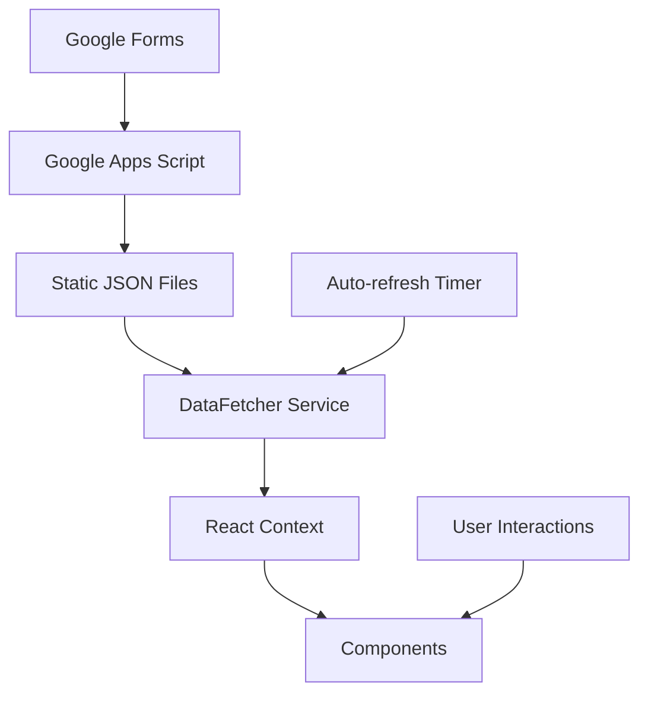

# Parking Finder - Developer Guide

## Architecture Overview

The Parking Finder is a React-based single-page application that displays real-time parking information on an interactive map. The system follows a static-first architecture with periodic data updates.

### Technology Stack

- **Frontend**: React 19 with TypeScript
- **Build Tool**: Vite
- **Map Library**: Leaflet.js with React-Leaflet
- **Styling**: CSS Modules
- **Testing**: Vitest + React Testing Library + Playwright
- **Data Storage**: Static JSON files
- **Admin Interface**: Google Forms + Google Apps Script
- **Hosting**: GitHub Pages / Netlify / Vercel

### Project Structure

```
parking-finder/
├── src/
│   ├── components/          # React components
│   ├── services/           # Data fetching and business logic
│   ├── hooks/              # Custom React hooks
│   ├── types/              # TypeScript type definitions
│   ├── utils/              # Utility functions
│   ├── contexts/           # React context providers
│   └── styles/             # Global styles
├── tests/
│   ├── e2e/               # End-to-end tests (Playwright)
│   ├── integration/       # Integration tests
│   └── performance/       # Performance tests
├── docs/                  # Documentation
├── admin/                 # Admin tools and scripts
└── public/                # Static assets
```

## Development Setup

### Prerequisites

- Node.js 18+ and npm
- Git
- Modern web browser

### Installation

```bash
git clone <repository-url>
cd parking-finder
npm install
```

### Development Commands

```bash
npm run dev          # Start development server
npm run build        # Build for production
npm run preview      # Preview production build
npm run test         # Run unit tests
npm run test:e2e     # Run end-to-end tests
npm run lint         # Run ESLint
```

## Component Architecture

### Core Components

#### App.tsx
- Root component managing global state
- Handles data fetching and auto-refresh
- Manages responsive layout

#### MapView
- Renders Leaflet map with parking markers
- Handles marker interactions and selections
- Manages map state and zoom levels

#### InfoPanel
- Displays detailed parking information
- Shows capacity, rules, and directions
- Handles empty states

#### SearchBar
- Provides search functionality
- Filters parking locations by name/address
- Debounced input for performance

### Component Patterns

#### CSS Modules
```typescript
import styles from './Component.module.css';

const Component = () => (
  <div className={styles.container}>
    <h1 className={styles.title}>Title</h1>
  </div>
);
```

#### TypeScript Props
```typescript
interface ComponentProps {
  data: ParkingLocation[];
  onSelect: (location: ParkingLocation) => void;
  className?: string;
}

const Component: React.FC<ComponentProps> = ({ data, onSelect, className }) => {
  // Component implementation
};
```## D
ata Flow

### Data Architecture



### Data Types

#### ParkingLocation
```typescript
interface ParkingLocation {
  id: string;
  name: string;
  address: string;
  coordinates: {
    lat: number;
    lng: number;
  };
  capacity: {
    total: number;
    available: number;
    reserved?: number;
  };
  rules: {
    timeLimit?: string;
    cost?: string;
    restrictions?: string[];
    hours?: string;
  };
  type: 'street' | 'lot' | 'structure' | 'garage';
  lastUpdated: string;
}
```

#### AppConfig
```typescript
interface AppConfig {
  branding: {
    name: string;
    logo?: string;
    primaryColor: string;
    secondaryColor: string;
    backgroundImage?: string;
    customCSS?: string;
  };
  map: {
    center: {
      lat: number;
      lng: number;
    };
    zoom: number;
  };
  dataSource: {
    url: string;
    refreshInterval: number;
  };
}
```

### Service Layer

#### DataFetcher
Handles all data operations:
- Fetches parking data and configuration
- Implements caching with localStorage
- Handles offline scenarios
- Provides retry logic for failed requests

```typescript
const dataFetcher = new DataFetcher({
  baseUrl: '/api',
  timeout: 5000,
  maxRetries: 3,
  retryDelay: 1000,
  cacheExpiry: 300000, // 5 minutes
  offlineCacheExpiry: 86400000, // 24 hours
});
```

#### AutoRefreshService
Manages periodic data updates:
- Configurable refresh intervals
- Preserves user state during updates
- Handles errors gracefully

```typescript
const autoRefresh = new AutoRefreshService(
  () => dataFetcher.fetchParkingData(),
  300000 // 5 minutes
);
```

## Testing Strategy

### Unit Tests
- Component behavior testing with React Testing Library
- Service logic testing with Vitest
- Utility function testing
- Mock external dependencies (Leaflet, fetch)

### Integration Tests
- Full app workflow testing
- Data service integration
- Component interaction testing
- Error scenario handling

### End-to-End Tests
- Complete user workflows with Playwright
- Cross-browser compatibility
- Mobile responsiveness
- Accessibility compliance

### Performance Tests
- Large dataset handling
- Search performance
- Memory usage optimization
- Concurrent operation handling

## State Management

### React Context
Global state managed through React Context:

```typescript
interface AppContextType {
  parkingData: ParkingLocation[];
  appConfig: AppConfig | null;
  selectedLocation: ParkingLocation | null;
  searchResults: ParkingLocation[];
  isLoading: boolean;
  error: string | null;
  lastUpdated: Date | null;
}
```

### Local State
Component-specific state using useState and useReducer:
- Form inputs
- UI toggles
- Temporary selections

## Performance Optimization

### Rendering Optimization
- React.memo for expensive components
- useMemo for computed values
- useCallback for event handlers
- Lazy loading for non-critical components

### Data Optimization
- Debounced search input
- Cached API responses
- Efficient data structures
- Minimal re-renders

### Bundle Optimization
- Code splitting with dynamic imports
- Tree shaking for unused code
- Asset optimization
- CDN for static resources

## Error Handling

### Error Boundaries
React Error Boundaries catch component errors:

```typescript
class ErrorBoundary extends React.Component {
  componentDidCatch(error: Error, errorInfo: ErrorInfo) {
    console.error('Component error:', error, errorInfo);
  }
  
  render() {
    if (this.state.hasError) {
      return <ErrorFallback />;
    }
    return this.props.children;
  }
}
```

### Service Error Handling
- Network timeout handling
- Retry logic with exponential backoff
- Graceful degradation to cached data
- User-friendly error messages

### Validation
- Runtime type checking for API responses
- Input validation for search queries
- Coordinate validation for map data

## Accessibility

### WCAG 2.1 AA Compliance
- Semantic HTML structure
- ARIA labels and roles
- Keyboard navigation support
- Screen reader compatibility
- Color contrast compliance

### Implementation
```typescript
// Proper ARIA labels
<button 
  aria-label="Search parking locations"
  onClick={handleSearch}
>
  Search
</button>

// Keyboard navigation
const handleKeyDown = (event: KeyboardEvent) => {
  if (event.key === 'Enter' || event.key === ' ') {
    handleClick();
  }
};
```

## Deployment

### Build Process
1. TypeScript compilation
2. Asset optimization
3. Bundle generation
4. Static file preparation

### CI/CD Pipeline
GitHub Actions workflow:
- Run tests on pull requests
- Build and deploy on main branch
- Performance monitoring
- Error tracking

### Environment Configuration
- Development: Local development server
- Staging: Preview deployments
- Production: Optimized build with CDN

## Monitoring and Analytics

### Error Tracking
- JavaScript error monitoring
- API failure tracking
- Performance metrics
- User experience monitoring

### Performance Monitoring
- Core Web Vitals tracking
- Bundle size monitoring
- API response times
- User interaction metrics

## Contributing Guidelines

### Code Style
- ESLint configuration for consistency
- Prettier for code formatting
- TypeScript strict mode
- Conventional commit messages

### Pull Request Process
1. Create feature branch
2. Write tests for new functionality
3. Update documentation
4. Submit pull request with description
5. Code review and approval
6. Merge to main branch

### Testing Requirements
- Unit tests for new components
- Integration tests for new features
- E2E tests for user workflows
- Performance tests for optimizations

## Troubleshooting

### Common Development Issues

#### Map Not Rendering
- Check Leaflet CSS imports
- Verify container dimensions
- Check console for JavaScript errors

#### Data Not Loading
- Verify API endpoints
- Check network requests in DevTools
- Validate JSON response format

#### Build Failures
- Clear node_modules and reinstall
- Check TypeScript errors
- Verify import paths

### Debugging Tools
- React Developer Tools
- Redux DevTools (if using Redux)
- Browser DevTools Network tab
- Lighthouse for performance auditing

## Future Enhancements

### Planned Features
- Real-time WebSocket updates
- Advanced filtering options
- Parking reservation system
- Mobile app development

### Technical Improvements
- Service Worker for offline support
- Progressive Web App features
- Advanced caching strategies
- Micro-frontend architecture

### Scalability Considerations
- Database integration
- API rate limiting
- CDN optimization
- Load balancing

---

This developer guide provides the foundation for maintaining and extending the Parking Finder application. For specific implementation details, refer to the inline code documentation and test files.